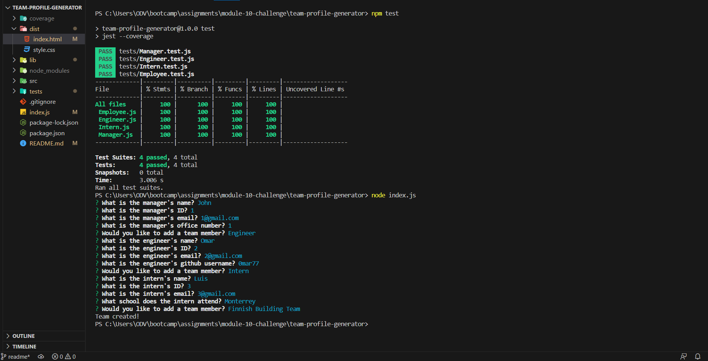
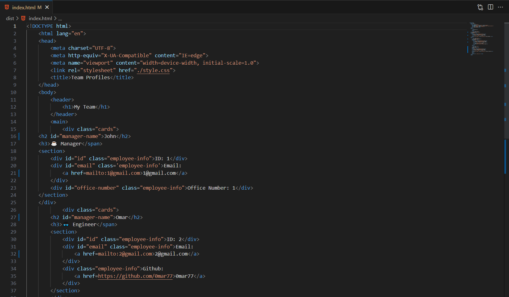
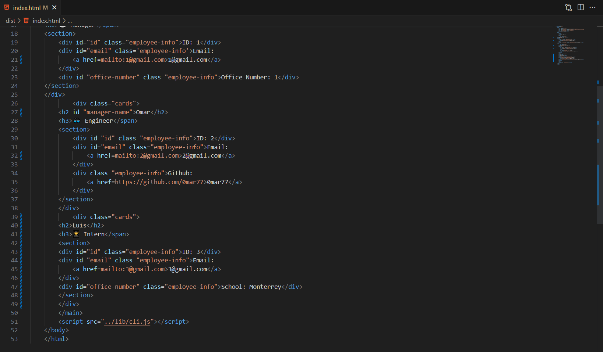
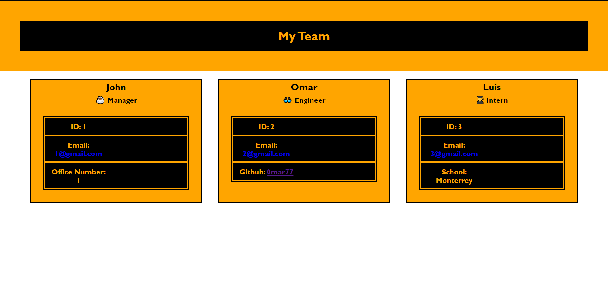

# Team Profile Generator

# Descrition 

- The motivation behind this project was to help the user keep track of his team members
- I built this project to help the user keep track of his team
- This project will help the user have quick access to his team member's information
- Creating this project helped me learn how to use jest and how to use object oriented programming

# Usage

- To start the app, user must type in "node index.js" into the terminal 
- Answer questions and create as many team members as needed
- Click on "Finished building team" to render an html file with your team

- Path to sample HTML file: dist/index.html

Link to walkthrough video:[https://drive.google.com/file/d/1v8-hyDwsPdNQT3LqJxN_XxkEeidPX8qH/view?usp=sharing]

